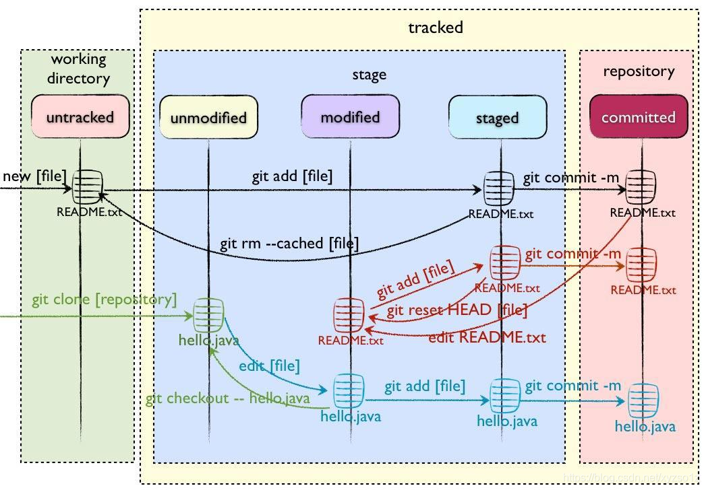

# Git & Gerrit 使用参考
*by power*<br/>
*2023/12/12*<br/>
<br/>

## Git

### 1. Git简介
Git是目前世界上最先进的分布式版本控制系统。<br/>
SVN与Git的的区别：<br/>
- 分布式 vs 集中式：Git 是一种分布式版本控制系统，而 SVN 是一种集中式版本控制系统。在 Git 中，每个开发者都拥有本地代码库的完整副本，可以离线工作并在不同的工作流程之间自由转换。而在 SVN 中，所有开发者共享同一个中央代码库，并且需要有网络连接才能进行版本控制操作。
- 分支管理：Git 在分支管理方面比 SVN 更加强大和灵活。Git 的分支非常轻量级，创建和合并分支也很容易，因此可以轻松实现多人协作和并行开发。而在 SVN 中，分支比较重量级（即创建和合并分支需要花费相对更多的时间和资源），因此往往只用于重要的版本分支。
版本号：Git 使用 SHA-1 哈希值来标识每个提交，而 SVN 采用递增的数字版本号来标识每个提交。SHA-1 哈希值保证了每个提交的唯一性，而递增版本号则简化了版本控制过程。
- 整体性：由于 SVN 是一种集中式版本控制系统，因此所有数据都存储在中央代码库中。如果中央代码库损坏或丢失，可能会导致数据丢失或无法恢复。而 Git 是一种分布式版本控制系统，每个开发者都拥有完整的代码库副本，保证了代码的整体性和可靠性。
- 性能：Git 比 SVN 更快，特别是在处理大型仓库、分支合并以及比较代码差异时。Git 使用基于内容的哈希算法来检测文件是否修改，而 SVN 则需要检查文件的元数据（如时间戳和文件大小）来确定是否修改。<br/>
<br/>

### 2. 安装Git
安装地址：https://git-scm.com/download/win <br/>
检查鼠标右键桌面菜单是否已有Git相关菜单选项。<br/>
<br/>

### 3. 工作方式
Git分为4个区域：
- 工作区，存放所有项目文件的地方
- 暂存区，保存工作区的变更，就是即将入库的文件列表
- 仓库区，安全存放数据的位置，包含所有版本信息
- 远程仓库，托管代码的服务器，用于代码审查、数据交换
<br/>

### 4. 一般流程
- 在工作目录中添加、修改、删除文件(modified)；
- 将需要进行版本管理的文件放入暂存区(staged)；
- 将暂存区域的文件提交git仓库(committed)；
- 将本地git仓库修改推送到远程仓库；
因此，git管理的文件有三种状态：已修改(modified)、已暂存(staged)、已提交(committed)

<br/>

### 5. 文件的四种状态
版本控制就是对文件的版本控制，要对文件进行修改、提交等操作，首先要知道文件当前在什么状态，不然可能会提交了现在还不想提交的文件，或者要提交的文件没提交上。<br/>
GIt不关心文件两个版本之间的具体差别，而是关心文件的整体是否有改变，若文件被改变，在添加提交时就生成文件新版本的快照，而判断文件整体是否改变的方式就是用SHA-1算法计算文件的校验和。<br/>

- Untracked：未跟踪，此文件在文件夹中但并没有加入到git库，不参与版本控制，通过git add 状态变为Staged。
- Unmodify：文件已经入库，未修改，即版本库中的文件快照内容与文件夹中完全一致，这种类型的文件有两种去处，1. 如果被修改，而变成Modefied,2. 如果使用git rm移除版本库，则成为Untracked文件。
- Modified：文件已修改，仅仅是修改，并没有进行其他操作，这个文件也有两个去处，1. 通过git add可进入暂存Staged状态，2. 使用给git checkout 则丢弃修改内容，返回Unmodifiy状态，这个git checkout 即从库中去除文件，覆盖当前修改。
- Staged：暂存状态，执行git commit 则将修改同步到库中，这时库中的文件和本地文件又变为一致，文件为Unmodify状态，执行git reset HEAD filename取消暂存，文件状态为Modified。

<br/>
### 6. 分支管理
- master，存放每一阶段完成的项目，master分支的代码永远是稳定的，经过测试的，tag基于master分支
- dev，用于开发项目，项目完成后需要合并到master
- fix，用于紧急修复线上bug，完成后需要合并到master

### 7. 常用命令
克隆：
```shell
git clone
```
查看当前状态：
```shell
git status
```
查看日志：

```shell
git log
git reflog
```
查看修改：

```shell
git diff [文件名]
```
查看分支：

```shell
git branch
```
将文件添加到暂存区：

```shell
git add <文件名>  #添加指定文件
git add .        #添加所有变更文件
```
将暂存区文件提交入库：
```shell
git commit -m '注释'  #注释内容必须填写
```
推送到远程仓库：
```shell
git push
git push origin HEAD:refs/for/dev  #推送到Gerrit
```
从远程仓库拉取：
```shell
git pull
git pull --rebase   #rebase方式(推荐)
```
切换分支：
```shell
git checkout <branch>
```
合并：
```shell
git merge <branch>
```
回退：
```shell
git reset --soft <commit>  #软回退
git reset --hard <commit>  #硬回退
```
<br/>

## Gerrit

### 1. Gerrit简介
Gerrit 是建立在Git版本控制系统之上并且基于Web的一个免费开源的轻量级代码审查工具。 作为开发者和Git之间的一层屏障，不允许直接将本地修改内容同步到远程仓库中。 与Jenkins集成后，可以在每次提交代码后，人工审核代码前，通过Jenkins任务自动运行单元测试、构建以及自动化测试，如果Jenkins任务失败，会自动打回本次提交。<br/>
Code review的目的是团队成员在一起共同学习，代码回顾的学习重点是团队成员共同识别模式，这里的模式是指程序员编写代码的习惯，包括”好模式”和”反模式”。团队成员通过阅读最近编写的测试代码和生产代码来识别”好模式”和”反模式”，既是团队成员之间相互学习的过程，也是团队整体达成整洁代码共识的过程。<br/>
<br/>

### 2. 一般流程
当进行commit时，必须要生成一个Change-Id，否则，push到gerrit服务器时，会收到一个错误提醒。<br/>
提交者不能直接把代码推到远程仓库，这样就相当于越过了gerrit了。 gerrit必须依赖于一个refs/for/*的分支。<br/>
- 开发者提交代码到Gerrit
- 触发对应的Jenkins任务，通过以后Verified加1
- 人工审核，审核通过后code review加2，触发对应的Jenkins任务
- 通过以后确认本次提交，Gerrit执行与Git仓库的代码同步操作
- 代码进入Git仓库


### 3. 登录账号设置邮箱
首次登录Gerrit后需要填入邮箱地址激活（或者管理员在创建账号时绑定邮箱）。<br/>
<br/>

### 4. 设置ssh公钥
以下命令生成ssh公钥
```shell
ssh-keygen -t rsa -C “your email”
```
转到Gerrit设置->SSH keys->ADD NEW，输入以上命令生成的ssh公钥。<br/>
<br/>

### 5. 配置本地用户
```shell
git config --global user.name <用户名>
git config --global user.email <邮箱>
```

### 6. 查看项目
点击browse下的repositories进行查看，项目较多时，可以在filter中输入名称进行过滤。<br/>
<br/>

### 7. 克隆代码
复制项目主页的git clone命令，第一条命令是附带提交勾子脚本（Gerrit代码审查必须附带change-id）。<br/>
<br/>

### 8. 代码审查
进入Gerrit首页后，会列出审查列表，每一条对应一条commit，进入详情页可以看到作者、时间、文件列表等，阅读修改记录后可以对此条commit打分和评论，分数从-2分到+2分5个分值，其分别代表：
- -2，这个代码很糟糕，我坚决反对，必须不能通过
- -1，这个代码看上去不太好，但需要其他人审查确定
- 0，我没有细看代码
- +1，这个代码看起来没毛病，但需要其他人审查确定
- +2，这个代码很不错，同意通过 

分值不能累加，即两个+1不等于+2。<br/>
最终必须至少有一个+2并且没有-2才能submit。<br/>
当被打了负分而需要修改提交时，参考以下两种做法：
- 在本地修改代码，git add -> git commit amend --no-edit -> git push，然后通知团队重新审查打分。
- 或者在审查页面点击“ABANDON”放弃本次提交。

确认本地提交没有问题后，可以点击“submit”合并代码。